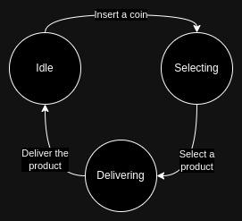

# Introduction
This repo mimics the behaviour of a centrallized vending machine controller. Each vending machine can be in one of the three states below:
1. **Idle**
    - Initial state of each vending machine. Accepts coin insertions in this state. Returns to this states after the product is successfuly delivered or the operation is aborted.
2. **Selecting**
    - After inserting some amount of money in the machine, it transits to this state. Products can be selected in this state.
3. **Delivering**
    - After selecting the product successfuly the machine transits to this state and after successfuly delivering the product to the customer, it transits to **Idle** state again.



# Local Development
To clean and/or generate mocks:
```bash
make cleanmocks
make genmocks
```
To run lint and test:
```bash
make lint && make test
```
To run the program locally:
```bash
make run
```
To build and push an image:
```bash
make build-image && make push-image
```
To run a containerized version (make sure to sync `CONTAINER_PORT`, `HOST_PORT` and the `config.yaml` properties):
```bash
make run-container
```
- Make sure to change the `config.yaml` according to your pereferences .

# TODO
- Implement a WAL mechanism to prevent data loss/corruption
- Add GitHub Actions